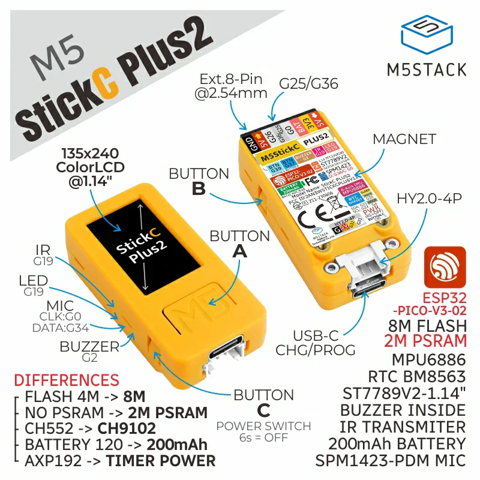

# M5StickOS

A sleek, functional, and modern operating system designed for the M5StickC Plus2 using the Arduino IDE. 

## Features
- **Multi-app Interface:** Includes a card-carousel menu and button-based navigation.
- **Hardware Integration:** Utilizes the TFT screen, IMU, Microphone, IR, and more.
- **Modern Aesthetics:** "Warm Dark" theme with a clean, flicker-free rendering using the M5Unified library.
- **Multiple Applications:** Features eight distinct functional applications, including an IR remote.

## Getting Started
1. Open `M5StickOS.ino` in the Arduino IDE.
2. Ensure you have the `M5Unified` library installed.
3. Select the M5StickC Plus2 board.
4. Compile and upload the sketch to your device.
